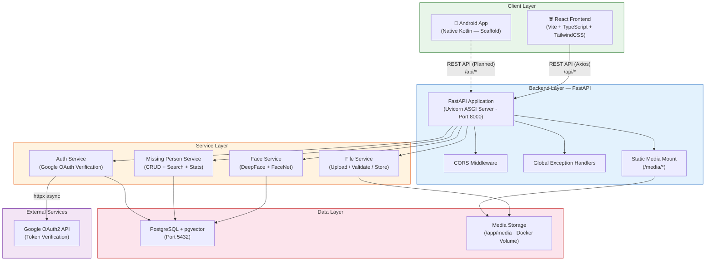
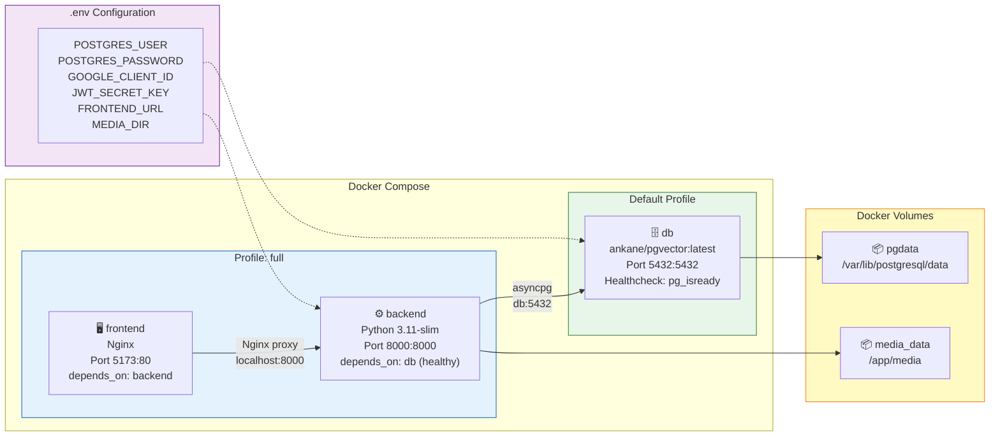
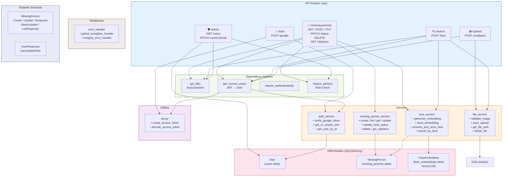
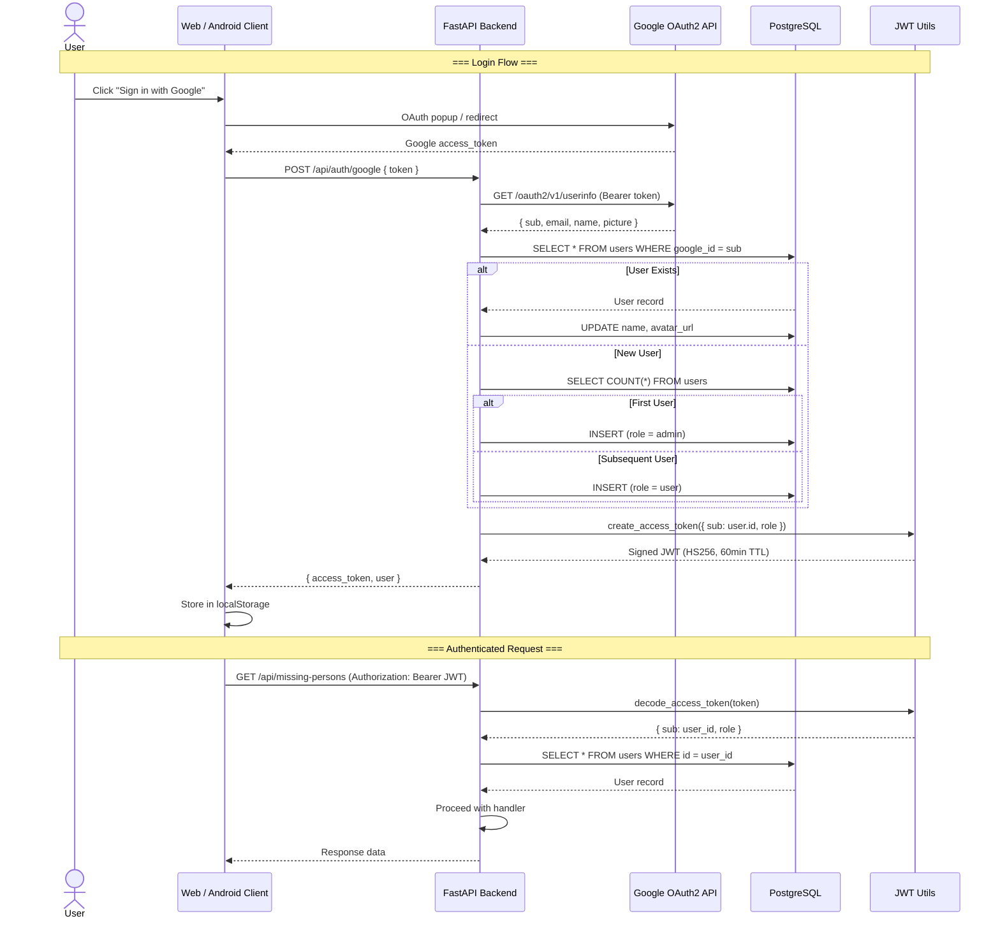
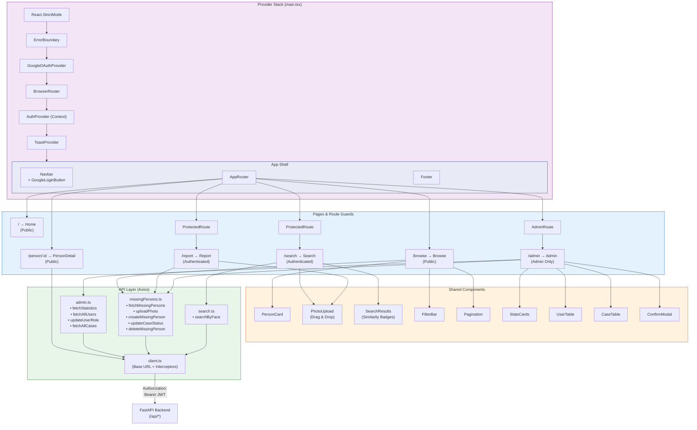
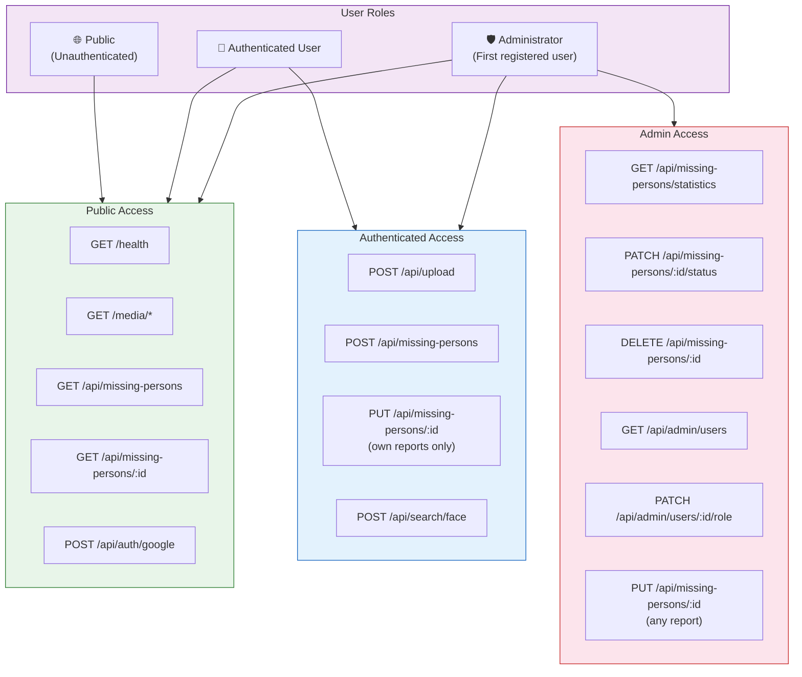

# Missing Person Identification System — Architecture

> A full-stack missing person reporting and AI-powered facial recognition search platform.

---

## 1. High-Level System Architecture



---

## 2. Docker Infrastructure



---

## 3. Backend Architecture (FastAPI)



---

## 4. Database Schema (Entity-Relationship)

```mermaid
erDiagram
    USERS {
        int id PK
        string email UK "indexed"
        string name
        string google_id UK
        string avatar_url "nullable"
        enum role "admin | user"
        datetime created_at "server default now()"
    }

    MISSING_PERSONS {
        int id PK
        string full_name "indexed"
        int age "nullable"
        date date_of_birth "nullable"
        enum gender "male | female | other"
        string photo_url "nullable"
        string last_seen_location
        date last_seen_date "nullable"
        float height "nullable"
        float weight "nullable"
        string distinguishing_marks "nullable"
        string reporter_contact "nullable"
        enum case_status "missing | found | under_investigation"
        int reported_by FK
        datetime created_at
        datetime updated_at
    }

    FACE_EMBEDDINGS {
        int id PK
        int missing_person_id FK UK "CASCADE delete"
        vector_128 embedding "pgvector Vector(128)"
    }

    USERS ||--o{ MISSING_PERSONS : "reports"
    MISSING_PERSONS ||--o| FACE_EMBEDDINGS : "has face"
```

---

## 5. Authentication & Authorization Flow



---

## 6. Face Recognition Pipeline

```mermaid
flowchart TD
    subgraph Registration["📋 Case Registration Pipeline"]
        A1["User submits report\nwith photo"] --> A2["POST /api/upload\n(multipart/form-data)"]
        A2 --> A3["file_service.save_upload()\n• Validate type & size (≤5MB)\n• Generate UUID filename\n• Write to /media/"]
        A3 --> A4["POST /api/missing-persons\n(JSON + photo_url)"]
        A4 --> A5["missing_person_service\n.create_missing_person()"]
        A5 --> A6["face_service\n.process_and_store_face()"]
        A6 --> A7["DeepFace.represent()\nModel: FaceNet\nDetector: OpenCV"]
        A7 --> A8{"Face\ndetected?"}
        A8 -- Yes --> A9["128-dim embedding vector"]
        A9 --> A10["face_service.store_embedding()\nINSERT INTO face_embeddings"]
        A10 --> A11["✅ Case created\nwith face indexed"]
        A8 -- No --> A12["⚠️ Case created\nwithout embedding"]
    end

    subgraph SearchPipeline["🔍 Face Search Pipeline"]
        B1["User uploads query photo"] --> B2["POST /api/search/face\n(multipart + threshold + limit)"]
        B2 --> B3["file_service.validate_image()\nWrite temp file"]
        B3 --> B4["face_service.search_by_face()"]
        B4 --> B5["DeepFace.represent()\nGenerate query embedding"]
        B5 --> B6{"Face\ndetected?"}
        B6 -- Yes --> B7["pgvector cosine_distance\nquery against all embeddings\nWHERE distance < threshold"]
        B7 --> B8["JOIN missing_persons\nORDER BY distance ASC\nLIMIT N"]
        B8 --> B9["Calculate similarity %\n= (1 - distance) × 100"]
        B9 --> B10["🎯 Return matched persons\nwith similarity scores"]
        B6 -- No --> B11["❌ No face detected\nin uploaded image"]
        B2 --> B12["Cleanup: delete temp file"]
    end

    style Registration fill:#e8f5e9,stroke:#2e7d32
    style SearchPipeline fill:#e3f2fd,stroke:#1565c0
```



---

## 7. Frontend Architecture (React)



---

## 8. Complete Request Data Flow

```mermaid
flowchart LR
    subgraph Client["Client"]
        UserAction["User Action\n(Click / Submit)"]
    end

    subgraph FrontendFlow["Frontend (React)"]
        Page["Page Component\n(e.g. Report.tsx)"]
        Form["react-hook-form\n+ Zod Validation"]
        APIModule["API Module\n(Axios call)"]
        Interceptor["Request Interceptor\n(Attach JWT)"]
    end

    subgraph BackendFlow["Backend (FastAPI)"]
        CORSCheck["CORS Middleware"]
        DepInject["Dependency Injection\n(get_db + get_current_user)"]
        RouterHandler["Router Handler"]
        ServiceCall["Service Layer"]
        ORM["SQLAlchemy ORM"]
    end

    subgraph Data["Data Stores"]
        PostgreSQL["PostgreSQL\n+ pgvector"]
        Disk["File System\n(media/)"]
    end

    UserAction --> Page
    Page --> Form
    Form --> APIModule
    APIModule --> Interceptor
    Interceptor --> CORSCheck
    CORSCheck --> DepInject
    DepInject --> RouterHandler
    RouterHandler --> ServiceCall
    ServiceCall --> ORM
    ORM --> PostgreSQL
    ServiceCall --> Disk

    PostgreSQL --> ORM
    ORM --> ServiceCall
    ServiceCall --> RouterHandler
    RouterHandler --> APIModule
    APIModule --> Page
    Page --> UserAction

    style Client fill:#fff9c4,stroke:#f57f17
    style FrontendFlow fill:#e3f2fd,stroke:#1565c0
    style BackendFlow fill:#fff3e0,stroke:#e65100
    style Data fill:#fce4ec,stroke:#c62828
```



---

## 9. Role-Based Access Control (RBAC)



---

## 10. Technology Stack Summary

| Layer | Technology | Purpose |
|-------|-----------|---------|
| **Android** | Kotlin · AppCompat · ConstraintLayout | Native mobile client (scaffold) |
| **Frontend** | React 18 · TypeScript · Vite 8 | Web SPA |
| **Styling** | TailwindCSS 3 | Utility-first CSS |
| **Forms** | react-hook-form · Zod | Validation & state |
| **Auth (Client)** | @react-oauth/google | Google OAuth popup |
| **HTTP Client** | Axios | API communication |
| **Backend** | FastAPI 0.115 · Python 3.11 | REST API server |
| **ASGI Server** | Uvicorn 0.30 | Production server |
| **ORM** | SQLAlchemy 2.0 (async) | Database abstraction |
| **DB Driver** | asyncpg | Async PostgreSQL |
| **Database** | PostgreSQL + pgvector | Relational + vector storage |
| **Migrations** | Alembic | Schema versioning |
| **Face AI** | DeepFace + FaceNet | 128-dim embedding extraction |
| **Vector Search** | pgvector cosine_distance | Similarity matching |
| **Auth (Server)** | python-jose (JWT) · httpx | Token signing & Google verification |
| **File Upload** | python-multipart | Multipart form handling |
| **Containerization** | Docker Compose | Multi-service orchestration |
